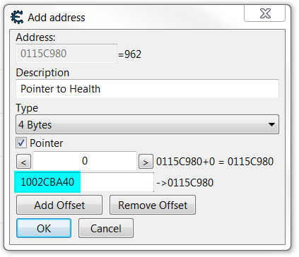

# ⚙️ Simple Disassembly Notes 🔧
⚙️ Simple Step to Step Tutorials for disassembling 🔧

## 🔧 Get Pointer Address from Value 🔧

1. Set Value Type **All**
2. Set Value (ex. (Int 32 = 4 Byte = 32 Bit) 85 or (float/double) 85.5) you search for and press **First Scan**

3. Change Value in the Process
4. The Changed Value will be red, on the left is the **Pointer Address**

## 🔧 Replace the Assembly Code with Code that does Nothing  🔧

1. Right Click on Address Record
2. Select **Find out what writes to this address**
3. Press on **Replace**

4. **Delete the Assembly Code** and Press **OK**

## 🔧 Get the Pointer Address from the Pointer of the Value (Way 1 : easier) 🔧

1. Read the Address

2. **Check Checkbox Hex** and put the Address in it
3. The **Address** to the Pointer is in this ex. 1002CBA40

## 🔧 Get the Pointer Address from the Pointer of the Value (Way 2 : harder) 🔧

1. Get the Address

4. The **Address** to the Pointer is in this ex. 011DC7A0

## 🔧 Add Pointer Address manually 🔧

1. Click on Add Address Manually

2. Add Address, if needed with Offsets

3. The Result should look like this:

